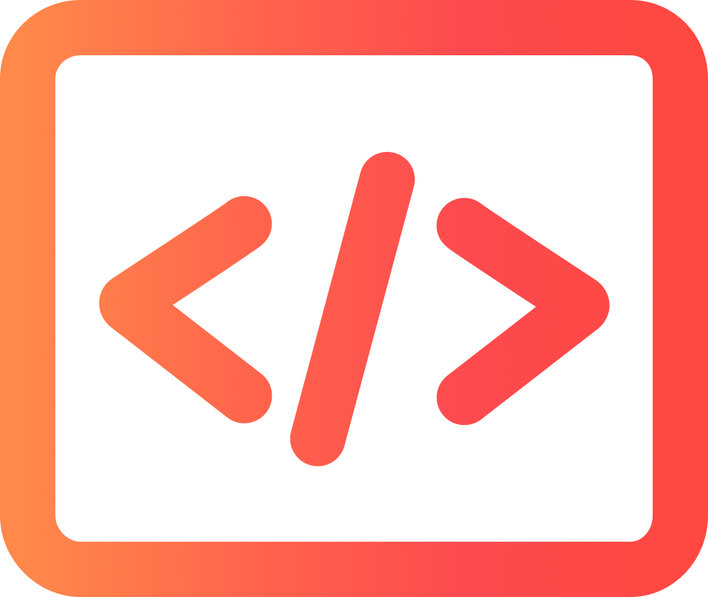

<h1 align="center">
 
  
 
 
Code Challenge - Electron
</h1>

In this code challenge we developed an app that provides an easy way to open favorite projects on VSCode.

  
  

## Participants

|  |  |
| :-----------------------------------------------------------------------------------------------------------------: | :-----------------------------------------------------------------------------------------------------------------------: |
|                                       [Diego F.](https://github.com/diego3g)                                        |                                      [João Paulo](https://github.com/jpdemagalhaes)                                       |

## Features

- :electron: **Electron** — desktop apps with JavaScript, HTML, and CSS
- 🔺**Sentry** - cross platform application monitoring
- 💖**Lint** — ESlint, Prettier and EditorConfig

## Dependencies

- [Node.js](https://nodejs.org/en/) >= 8.0.0
- [Yarn](https://yarnpkg.com/pt-BR/docs/install)

## Getting started

1. Clone this repository;
2. `cd youtube-challenge-electron-tray`; 
3. Run `yarn` to install dependencies. 
4. Run `yarn start`.

## Contributing

Please read [CONTRIBUTING.md](CONTRIBUTING.md) for details on our code of conduct, and the process for submitting pull requests.

## License

This project is licensed under the MIT License - see the [LICENSE.md](LICENSE.md) file for details.
